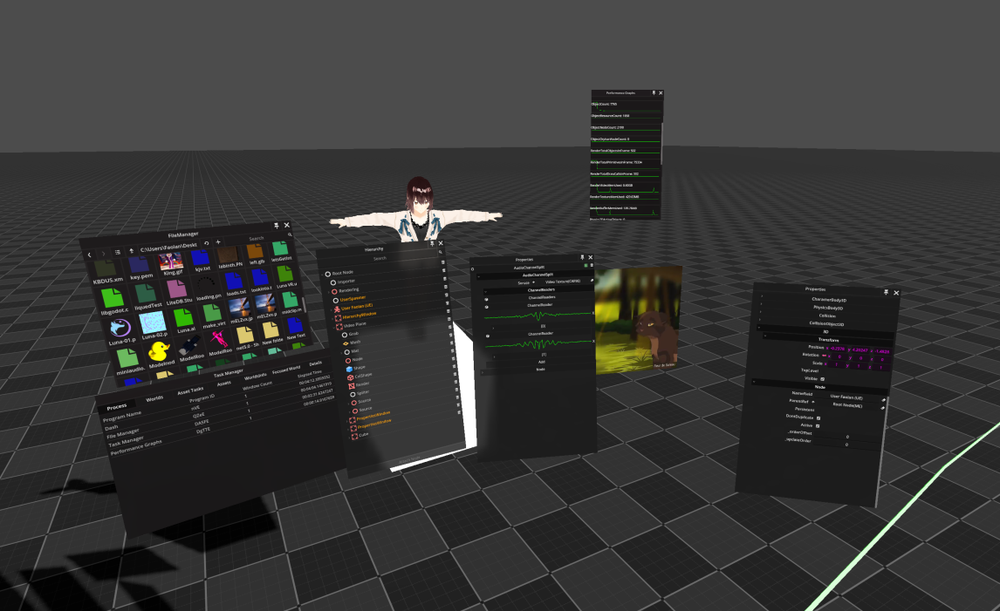

[![Stargazers][stars-shield]][stars-url]
[![Issues][issues-shield]][issues-url]

<!-- PROJECT LOGO -->
 

  

  <h3 align="center">Rhubarb VR</h3>

  

    A Networked VR Engine
     
    <a href="https://github.com/RhubarbVR/RhubarbVR/wiki"><strong>Explore the docs »</strong></a>
     
     
    <a href="https://rhubarbvr.net/">Web Site</a>
    ·
    <a href="https://discord.com/invite/GTQhxeq/">Discord</a>
    ·
    <a href="https://github.com/RhubarbVR/RhubarbVR/issues">Issues</a>
    ·
    <a href="https://github.com/RhubarbVR/RhubarbVR/issues/new?assignees=&labels=&template=bug_report.md&title=Report%20Bug%20Title">Report Bug</a>
    ·
    <a href="https://github.com/RhubarbVR/RhubarbVR/issues/new?assignees=&labels=&template=feature_request.md&title=Feature%20Request%20Title">Make Feature Request</a>
  

<!-- TABLE OF CONTENTS -->

  
Table of Contents

  <ol>
    <li>
      <a href="#about-the-project">About The Project</a>
      <ul>
        <li><a href="#libraries">Libraries</a></li>
      </ul>
    </li>
    <li>
      <a href="#preview">Preview</a>
    </li>
    <li><a href="#usage">Usage</a></li>
    <li><a href="#contact">Contact</a></li>
  </ol>

<!-- ABOUT THE PROJECT -->

## About The Project

RhubarbVR is a networked VR game engine. What does this mean? Well, Rhubarb is a game engine that allows you to add custom shaders and allows you to program in it. It does all of this while synchronizing modifications of the world with everyone in a session so you can collaborate and socialize with people to create amazing things. It allows you to make extensive multiplayer VR games and social experiences.

### Libraries

- [SteamWorksSDK](https://store.steampowered.com/)
- [Godot](https://github.com/godotengine/godot)
- [LiteNetLib](https://github.com/RevenantX/LiteNetLib)
- [Assimp](https://bitbucket.org/Starnick/assimpnet/src/master/)
- [SteamAudio](https://github.com/ValveSoftware/steam-audio)
- [Miniaudio](https://github.com/mackron/miniaudio)
- [LibVLCSharp](https://www.nuget.org/packages/LibVLCSharp/3.6.8?_src=template)

## Preview

## Usage

You can use this networked Engine for many things. For example, people can use it for socializing with others, making games, sharing their creativity with others, and educating people.

## Roadmap

If you want info on where RhubarbVR is going you can join the [DiscordServer](https://discord.com/invite/GTQhxeq/) for info.

1. See the [open issues](https://github.com/RhubarbVR/RhubarbVR//issues) for a list of proposed features (and known issues).
2. See the [Milestones](https://github.com/RhubarbVR/RhubarbVR/milestones) for a list of major features that are actively being implemented.

## Contact

1. Project Link: [https://github.com/RhubarbVR/RhubarbVR](https://github.com/RhubarbVR/RhubarbVR)
2. Website: [https://RhubarbVR.net](https://RhubarbVR.net)
3. DiscordServer: [https://discord.com/invite/GTQhxeq/](https://discord.com/invite/GTQhxeq/)

4. Faolan Rad - Main Developer/Owner - Discord @faolanrad

[stars-shield]: https://img.shields.io/github/stars/RhubarbVR/RhubarbVR.svg?style=for-the-badge
[stars-url]: https://github.com/RhubarbVR/RhubarbVR/stargazers
[issues-shield]: https://img.shields.io/github/issues/RhubarbVR/RhubarbVR.svg?style=for-the-badge
[issues-url]: https://github.com/RhubarbVR/RhubarbVR/issues
[product-screenshot]: images/screenshot.png
